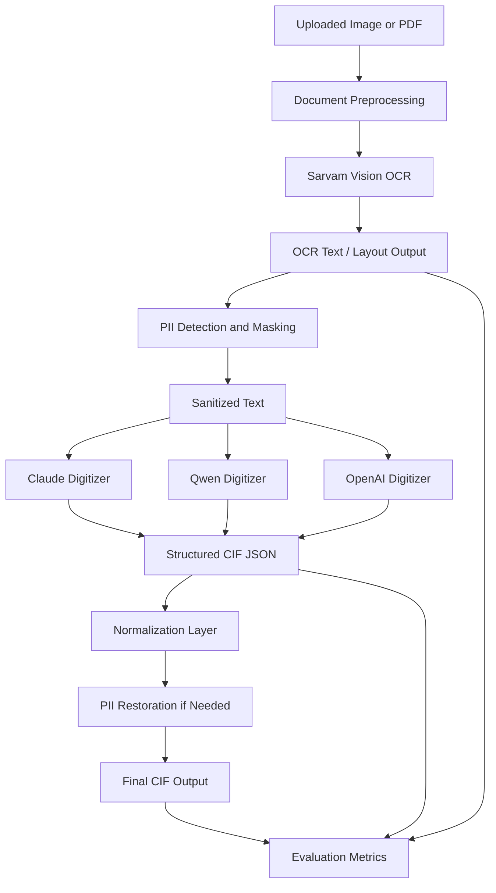

# Sarvam OCR, PII Masking, and Model Evaluation Plan

## Purpose

This document describes how to evolve the current CIF digitisation pipeline from a single-model flow into a safer and more modular pipeline:

1. Use `Sarvam Vision` for OCR extraction, especially for Indic scripts.
2. Mask or tokenize PII before sending extracted text to downstream LLMs.
3. Use Claude or other models only for structured digitisation.
4. Evaluate multiple models on the same OCR output.

The goal is to improve:

- OCR quality for Indic and handwritten text
- privacy protection for medical data
- model interchangeability
- evaluation quality and auditability

---

## Current State

At present, the application effectively uses a single multimodal model flow:

`document -> Claude/OpenRouter -> OCR + field extraction -> normalized CIF output`

This is simple, but it has limitations:

- OCR and digitisation are tightly coupled
- raw medical text is sent to the same model performing structuring
- model comparison is hard because the pipeline is not modular
- Indic OCR quality depends entirely on one provider

---

## Target State

The target architecture separates the pipeline into clear stages:

`document -> preprocessing -> Sarvam OCR -> PII masking -> digitisation model -> normalization -> final CIF output`

This means:

- Sarvam handles OCR
- downstream LLMs handle structuring
- PII is masked before external structuring calls
- multiple digitisation models can be compared fairly on the same OCR text

---

## Flow Chart



---

## Recommended Abstractions

The example shared by the team lead suggests using a base-class approach. For this project, two interfaces are cleaner than a single one.

### 1. OCR Extractor

Responsible only for text extraction from document input.

Suggested interface:

- `extract(document) -> OCRResult`

Possible implementations:

- `SarvamDocumentExtractor`
- `OpenRouterVisionExtractor`
- `OpenAIVisionExtractor`

### 2. Structured Digitizer

Responsible only for converting sanitized OCR text into CIF fields.

Suggested interface:

- `digitize(ocr_text) -> StructuredResult`

Possible implementations:

- `ClaudeDigitizer`
- `QwenDigitizer`
- `OpenAIDigitizer`

This separation is better than one universal extractor because:

- Sarvam and Claude are doing different jobs
- OCR evaluation and digitisation evaluation become independent
- the pipeline becomes easier to debug and benchmark

---

## PII Protection Strategy

The team requirement is to "hash PII before sending to Claude."

Practically, the best design is usually **tokenization or reversible masking**, not only irreversible hashing.

### Recommended approach

Detect sensitive values such as:

- patient name
- phone number
- address
- village if needed by policy
- family details or identifiers

Then replace them with stable placeholders:

- `PATIENT_NAME_1`
- `PHONE_1`
- `ADDRESS_1`
- `VILLAGE_1`

Store the mapping locally on the backend:

```text
PATIENT_NAME_1 -> Radhika Dwarya Dhanai
VILLAGE_1 -> Bordashi
```

Then:

1. Send only sanitized OCR text to the digitisation model.
2. Receive structured CIF output with placeholders.
3. Restore original values locally where allowed.

### Why this is better than only hashing

Pure hashing is privacy-safe, but it is harder for downstream models to reason over hashed content. Placeholder-based masking preserves structure while still protecting the original identity.

---

## How the Current Backend Split Helps

The recent backend refactor already makes this migration much easier.

### Current useful modules

- `backend/app/services/document_service.py`
  - file preprocessing
  - image and PDF handling
  - PDF-to-image conversion

- `backend/app/services/extraction_service.py`
  - currently handles model-based extraction
  - this should be split further into OCR and digitisation responsibilities

- `backend/app/services/normalization_service.py`
  - final CIF field cleanup and fallback logic
  - this is already the correct place for schema normalization

- `backend/app/services/job_service.py`
  - orchestrates the full pipeline
  - this is the right place to call OCR -> PII masking -> digitisation -> normalization

### Why this split matters

Without the refactor, Sarvam OCR, Claude digitisation, masking, and evaluation logic would all end up inside one monolithic file. With the service-based structure, each concern can be added in the correct layer.

---

## Suggested Service Design

The following structure fits your current backend well:

```text
backend/app/services/
├── document_service.py
├── ocr_service.py
├── pii_service.py
├── digitization_service.py
├── extraction_service.py
├── normalization_service.py
├── evaluation_service.py
└── job_service.py
```

### Responsibilities

#### `document_service.py`

- Accept image or PDF input
- Convert PDF pages to images
- Resize or optimize images for OCR

#### `ocr_service.py`

- Define OCR extractor interface
- Implement Sarvam OCR client
- Standardize OCR response into common format

#### `pii_service.py`

- Detect sensitive fields in OCR text
- Replace them with placeholders
- Maintain local mapping for restoration

#### `digitization_service.py`

- Define digitizer interface
- Implement Claude, Qwen, OpenAI digitization clients
- Convert sanitized OCR text into CIF JSON

#### `normalization_service.py`

- Normalize structured output into final CIF schema
- Apply field aliases and fallback extraction rules

#### `evaluation_service.py`

- Run the same OCR/digitization pipeline against multiple models
- compute metrics
- produce comparison reports

#### `job_service.py`

- Orchestrate the full flow for production jobs
- record metadata
- track stage status

---

## Suggested Pipeline in Production

### Stage 1. Document preprocessing

- Validate file
- Convert PDF to image if needed
- optimize image for OCR

### Stage 2. Sarvam OCR

- Send preprocessed document to Sarvam Vision
- retrieve OCR text and, if available, layout blocks

### Stage 3. PII masking

- Detect sensitive values
- replace with placeholders
- store mapping locally

### Stage 4. Digitisation

- Send sanitized OCR text to selected digitization model
- ask for CIF JSON only

### Stage 5. Normalization

- map alternate key names
- standardize dates, age, sex, treatment format
- fill schema consistently

### Stage 6. Restoration

- reinsert allowed original values using placeholder map

### Stage 7. Final result

- return CIF fields
- store metadata about OCR model, digitizer model, and timings

---

## Model Evaluation Methodology

Evaluation should be run as a separate workflow, even if it reuses the same service classes.

### Inputs

- a set of representative CIF documents
- images and PDFs
- handwritten Indic samples
- ground truth fields for each sample

### Evaluation design

For each document:

1. preprocess document
2. run OCR
3. sanitize OCR text
4. send same sanitized text to multiple digitizers
5. normalize all outputs
6. compare each result to ground truth

### Metrics to track

- field-level accuracy
- completeness
- exact-match rate for structured fields
- hallucination rate
- OCR failure rate
- latency per document
- cost per document

### Example evaluation matrix

| OCR Model | Digitization Model | Accuracy | Completeness | Latency | Cost |
|---|---|---:|---:|---:|---:|
| Sarvam | Claude Sonnet |  |  |  |  |
| Sarvam | Qwen |  |  |  |  |
| Sarvam | GPT-4 |  |  |  |  |
| Sarvam | GPT-3.5 |  |  |  |  |

---

## How to Implement This Incrementally

### Phase 1. Introduce OCR abstraction

- create OCR extractor base interface
- move current OCR-like logic out of the current extraction service
- add Sarvam as first-class OCR provider

### Phase 2. Introduce PII masking

- create masking service
- add reversible placeholder mapping
- sanitize OCR output before downstream digitization calls

### Phase 3. Introduce digitizer abstraction

- create digitizer base interface
- implement Claude/OpenRouter digitizer
- optionally add OpenAI and Qwen digitizers

### Phase 4. Update job orchestration

- change `job_service` to call:
  - preprocess
  - OCR
  - masking
  - digitization
  - normalization

### Phase 5. Add evaluation runner

- build a script or service that:
  - runs the same OCR output against multiple digitizers
  - stores metrics
  - outputs CSV/JSON/PDF summaries

---

## Suggested Mapping to Your Existing Files

### Existing file

`backend/app/services/extraction_service.py`

### Future split

- `ocr_service.py`
  - Sarvam OCR client

- `digitization_service.py`
  - Claude/Qwen/OpenAI digitizers

- `extraction_service.py`
  - optional orchestration wrapper, or retire this file if the responsibilities are fully split

### Existing file

`backend/app/services/job_service.py`

### Future role

Keep this as the pipeline controller:

- start job
- run each stage
- collect logs
- save metadata

### Existing file

`backend/app/services/normalization_service.py`

### Future role

Keep and expand this:

- normalize model outputs
- map aliases
- apply fallback logic

---

## Recommended Metadata to Store Per Job

For auditability and evaluation, store:

- OCR provider name
- OCR model name
- digitization provider name
- digitization model name
- whether PII masking was applied
- extraction time
- token/cost usage if available
- raw OCR text reference or masked OCR text reference
- normalized CIF output

---

## Risks and Considerations

### 1. OCR quality vs digitization quality

Bad OCR will limit every downstream model. Evaluation should distinguish OCR errors from digitization errors.

### 2. PII masking policy

You need agreement on what counts as sensitive and what can be restored later.

### 3. Indic-script normalization

Sarvam may return OCR text with mixed scripts, transliterations, or layout noise. The normalization layer should be prepared for that.

### 4. Placeholder consistency

If one patient name appears twice, the same placeholder must be reused consistently.

### 5. Evaluation fairness

All digitization models must receive the same sanitized OCR input for a fair comparison.

---

## Final Recommendation

The best design for this project is:

- `Sarvam` for OCR
- `PII masking/tokenization` on backend
- `Claude/OpenAI/Qwen` for structured CIF digitization
- `Normalization service` for final schema cleanup
- `Evaluation service` for model benchmarking

Your current backend refactor already supports this direction well. The next architectural improvement should be to split OCR, masking, and digitization into separate services with common interfaces.

---

## One-Line Summary

Move from a single-model OCR+digitization flow to a modular pipeline:

`Document -> Sarvam OCR -> PII Masking -> Digitization Model -> Normalization -> Evaluation`
