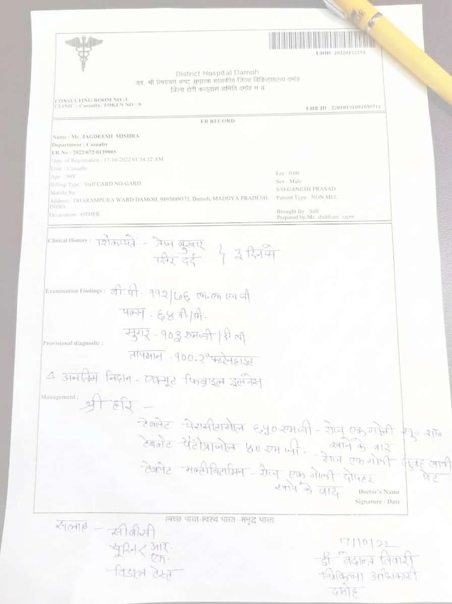

# CIF Digitisation Project: Consolidated Report

This report consolidates the field visit findings, the OCR and LLM evaluation note, and the landscaping. It presents the problem context, solution landscape, site observations, implementation progress, challenges, and the next 3 months roadmap for the CIF digitisation effort.

## 1. Problem Statement

Case Investigation File (CIF) documents are still being handled through a mix of handwritten registers, manual transcription, and portal entry. In practice, this creates avoidable duplication and slows down clinical and field workflows.

The core problem is not only text extraction. It is the end-to-end conversion of noisy, often handwritten, medically sensitive documents into structured records that can be reviewed, validated, and reused safely.

| Problem Area | Current Reality | Impact |
|---|---|---|
| Record capture | Prescriptions and investigation notes are often handwritten | Hard to read, easy to misinterpret |
| Duplicate entry | The same data is entered in registers and digital portals | Wasted staff time and repeated errors |
| Clinical sensitivity | Fields such as diagnosis, dosage, and age are clinically important | Errors can affect care quality and reporting |
| Operational load | PHC staff already manage patient flow, tests, and reporting | Little room for manual cleanup or re-entry |

The project therefore aims to digitise CIF records into a reliable, reviewable, and schema-validated workflow that reduces manual effort and improves data quality.

## 2. Landscaping

### 2.1 Industry Overview

Healthcare document digitisation sits at the intersection of OCR, medical record management, multilingual text handling, and human quality control. The source files show a realistic public-health setting:

| Industry Characteristic | Why It Matters |
|---|---|
| Handwritten clinical documents | OCR must handle poor handwriting and inconsistent formatting |
| Multilingual notes | The pipeline must support Hindi and mixed-language content |
| Safety-critical fields | Errors in dosage, diagnosis, age, or date require human review |
| Public health reporting | Outputs need to be structured enough for downstream dashboards and registers |
| Privacy and compliance | The system must be designed with access control and data minimisation in mind |

This is why a single-model approach is usually not enough. The better industry pattern is a hybrid pipeline with OCR, LLM structuring, validation, and review.

### 2.2 Multi-Model Approach

The landscaping study recommends a layered architecture rather than a single model doing every task.

| Approach | Strengths | Limitations | Fit for CIF |
|---|---|---|---|
| OCR only | Fast, cheap, and simple | Weak on handwriting, partial scans, and clinical structuring | Useful as the first extraction layer, not sufficient alone |
| LLM only | Can infer structure and clean text | More expensive, more variable, and less ideal for raw image interpretation | Not preferred as the only solution |
| Hybrid OCR + LLM | Separates extraction from structuring | Requires orchestration and validation | Best overall fit for CIF digitisation |
| Multi-model hybrid | Allows fallback, translation, and quality tiers | More complex to operate | Best for production and scaling |

Recommended model roles:

| Pipeline Layer | Candidate Models / Tools | Primary Role |
|---|---|---|
| OCR / document intelligence | Sarvam Vision | Extract text from scanned CIF documents |
| Post-OCR structuring | Gemini 2.5 Flash-Lite, GPT-4o mini, GPT-4.1 mini | Convert masked OCR text into structured records |
| Higher-end reasoning | GPT-4.1, Claude Sonnet 4 | Hard-case reasoning and quality benchmarking |
| Sarvam-native alternatives | Sarvam 30B, Sarvam 105B | Keep more of the workflow inside the Sarvam stack |
| Multilingual normalisation | Sarvam Translate, Mayura | Handle Hindi or mixed-language output |
| Offline baseline | Qwen2.5-7B, Qwen2.5-14B, Qwen2.5-32B | Local or air-gapped fallback after masking |
| Routing / abstraction | OpenRouter | Multi-provider access and fallback orchestration |

The practical takeaway is that the extraction system should be modular. OCR should be swappable, the structuring LLM should be benchmarked independently, and the final output must pass a strict validation layer before it is accepted.

### 2.3 Evaluation Methodology

The evaluation note and landscaping study both point to the same principle: compare candidates on the same test set, under the same conditions, and score them on both quality and operational cost.

| Metric | How It Is Measured | Why It Matters |
|---|---|---|
| Field accuracy | Exact or normalised match against human-reviewed ground truth | Core measure of correctness |
| Completeness | Percentage of required fields populated correctly | Important for usable structured records |
| Robustness | Repeated runs with small prompt or version changes | Important because LLMs are probabilistic |
| Concordance | Model-to-model and model-to-human agreement | Identifies stable candidates |
| Latency | End-to-end time and model inference time | Important for PHC throughput |
| Token usage | Input, output, and total tokens per document | Drives LLM cost and prompt design |
| Cost per document | OCR cost plus LLM and infrastructure cost | Needed for deployment planning |
| Failure modes | Handwriting, blur, mixed script, partial scans, missing values | Helps design fallback and review rules |

Recommended evaluation design:

| Step | Evaluation Activity | Output |
|---|---|---|
| 1 | Build a fixed benchmark set of representative documents | Stable comparison dataset |
| 2 | Run each candidate model or model stack on the same set | Comparable outputs |
| 3 | Score field-level correctness for key clinical fields | Accuracy report |
| 4 | Measure latency and token usage | Cost and throughput report |
| 5 | Review edge cases manually | Error taxonomy and mitigation ideas |
| 6 | Shortlist the best stack by quality-cost tradeoff | Production recommendation |

### 2.4 Pricing Analysis

The pricing note assumes 7,000 to 7,500 documents per year, one page per document for budgeting, and approximately 2,000 input tokens plus 250 output tokens per document after OCR and masking.

#### OCR / Document Intelligence Pricing

| Service | Pricing Signal | Cost per Document | Annual Cost for 7,000 Docs | Annual Cost for 7,500 Docs |
|---|---|---:|---:|---:|
| Sarvam Document Intelligence / Vision | Rs 0/page in API docs, Rs 1.50/page in the Sarvam pricing page | Rs 0 to Rs 1.50 | Rs 0 to Rs 10,500 | Rs 0 to Rs 11,250 |

#### LLM Structuring Pricing

| Model | Pricing Basis | Approx. Cost per Document | Annual Cost for 7,000 Docs | Annual Cost for 7,500 Docs |
|---|---|---:|---:|---:|
| Gemini 2.5 Flash-Lite | USD 0.10 input / USD 0.40 output per 1M tokens | USD 0.00030 | USD 2.10 | USD 2.25 |
| GPT-4o mini | USD 0.15 input / USD 0.60 output per 1M tokens | USD 0.00045 | USD 3.15 | USD 3.38 |
| Gemini 2.5 Flash | USD 0.30 input / USD 2.50 output per 1M tokens | USD 0.00123 | USD 8.58 | USD 9.19 |
| GPT-4.1 mini | USD 0.40 input / USD 1.60 output per 1M tokens | USD 0.00120 | USD 8.40 | USD 9.00 |
| Claude Haiku 3.5 | USD 0.80 input / USD 4.00 output per 1M tokens | USD 0.00260 | USD 18.20 | USD 19.50 |
| GPT-4.1 | USD 2.00 input / USD 8.00 output per 1M tokens | USD 0.00600 | USD 42.00 | USD 45.00 |
| Claude Sonnet 4 | USD 3.00 input / USD 15.00 output per 1M tokens | USD 0.00975 | USD 68.25 | USD 73.13 |

#### Planning Summary

| Pipeline Option | OCR Cost | LLM Cost | Deployment Style | Best Use Case |
|---|---|---|---|---|
| Sarvam Vision + Gemini 2.5 Flash-Lite | Rs 0 to Rs 11,250 / year | USD 2.10 to USD 2.25 / year | API-only | Lowest-cost API pipeline |
| Sarvam Vision + GPT-4o mini | Rs 0 to Rs 11,250 / year | USD 3.15 to USD 3.38 / year | API-only | Very cost-effective and simple |
| Sarvam Vision + GPT-4.1 mini | Rs 0 to Rs 11,250 / year | USD 8.40 to USD 9.00 / year | API-only | Balanced cost and quality |
| Sarvam Vision + Claude Haiku 3.5 | Rs 0 to Rs 11,250 / year | USD 18.20 to USD 19.50 / year | API-only | Stronger quality benchmark |
| Sarvam Vision + Sarvam 30B | Rs 0 to Rs 11,250 / year | Pricing page says free per token | API or local runtime | Sarvam-native balance |
| Sarvam Vision + Sarvam 105B | Rs 0 to Rs 11,250 / year | Pricing page says free per token | API or server-centric H100 runtime | Highest quality Sarvam-native option |
| Sarvam Vision + Qwen2.5-7B local | Rs 0 to Rs 11,250 / year | USD 17.50 to USD 18.75 / year equivalent | Local GPU | Offline or controlled deployment |

The field visit also matters for pricing. Since PHCs already have only a small number of desktops and the current process is manual, an API-first stack is more practical than a heavy on-prem GPU deployment. The main savings come from removing duplicate manual entry and reducing rework.

## 3. Situational Analysis

### 3.1 Field Visit Details

| Item | Details |
|---|---|
| Site | Urban Primary Health Centre in Lingarajapuram, Bengaluru |
| Study region | Lingarajapuram, Bengaluru, Karnataka |
| Visit date | 17-04-2026 |
| Purpose | Understand the real operational requirements for CIF digitisation |

The field visit confirmed that the PHC workflow is highly structured operationally, but record capture is still largely manual. The people, registers, tests, and portal forms already exist. What is missing is a clean digital capture layer at the point of care.

### 3.2 Staff Roles and Information Flow

| Role | Responsibility | Main Data Handled |
|---|---|---|
| Medical Officer | Clinical authority and final decision-making | Diagnosis, prescription direction, treatment oversight |
| Staff Nurse | Primary patient documentation and Treatment | Name, age, gender, date, disease, treatment |
| Pharmacist | Medicine dispensing | Issued medicines and injections |
| Lab Technician | Diagnostic testing | Test data and lab registers |
| PHC Officer | Supervisory consolidation | Primary, diagnostic, and regional reporting access |
| Health Investigating Officer | Ward-level surveillance and public health action | Local outbreaks, drainage issues, quarantine-related observations |
| D Group | Crowd control and cleaning support | Facility cleanliness and patient flow support |
| ASHA workers | Community-level reporting | Pregnant women, disabled persons, and household-level data |

### 3.3 Registers, Portal, and Forms

| Record System | Who Uses It | What It Stores | Current Limitation |
|---|---|---|---|
| Handwritten register - staff nurse | Staff nurse | Primary patient details and prescriptions | Time-consuming and error-prone |
| Handwritten register - lab technician | Lab technician | Diagnostic data | Separate from primary records |
| IHIP portal | Staff nurse, lab technician, PHC officer | Daily digital reporting | Requires repeat manual entry |
| P Form | Staff nurse | Primary data entry | Same information is also written elsewhere |
| L Form | Lab technician | Diagnostic entry | Not directly linked to prescription capture |
| S Form | PHC officer | Supervisory and regional data | Higher-level access but still dependent on manual input |

### 3.4 Work Culture and Real-World Workflow

**Clinical workflow**

| Step | Workflow Stage | Description |
|---|---|---|
| 1 | Patient arrival | Patient arrives at PHC |
| 2 | Examination | Examination by Medical Officer / Staff Nurse |
| 3 | Record capture | Patient details recorded in handwritten register |
| 4 | Dispensing | Medicines issued by Pharmacist |
| 5 | Diagnostics | Lab tests conducted if required |
| 6 | Digital entry | Data entered into IHIP portal |

**Community and reporting workflow**

| Step | Workflow Stage | Description |
|---|---|---|
| 1 | Household data collection | ASHA workers collect household data |
| 2 | Ward monitoring | Health Investigating Officers monitor ward-level events |
| 3 | Consolidation | PHC Officer consolidates reports |
| 4 | Record alignment | Data aligned with PHC records |

This workflow shows that the PHC process is already operationally organized, but the capture layer is fragmented across paper and digital systems. Patient information moves from consultation to dispensing, then to diagnostics, and finally into reporting. Because the same data is written more than once, transcription burden and inconsistency risk remain high. A digitisation layer can reduce duplication while preserving the existing clinical workflow.

### 3.5 Mother Card, RCH ID, and Continuity of Care

| Feature | Purpose | Why It Matters |
|---|---|---|
| Mother Card | Given to pregnant women during antenatal care | Supports follow-up across pregnancy |
| RCH ID | Unique identifier for a pregnant woman | Helps track mother and child health over time |
| Child vaccination linkage | Tracks the child up to the 16th year vaccination cycle | Requires accurate and persistent records |

### 3.6 Tests and Referral Structure

| Test Category | Examples Observed | Notes |
|---|---|---|
| Vector-borne disease testing | Dengue NS1, malaria rapid testing, malaria smear | Common in the local disease burden |
| Maternal health | ANC checkups, haemoglobin, serology, urine tests | Important for mother card and RCH continuity |
| Diabetes screening | OGCT, GRBS, FBS, PPBS | Routine non-communicable disease monitoring |
| Fever and infection workup | MR swab, Typhoid Vidal test | Used for symptomatic diagnosis |
| Referral-based testing | Thyroid and other unavailable tests | Referred to hospitals when local tools are missing |

### 3.7 Infrastructure and Constraints

| Constraint | What Was Observed | Why It Matters for Design |
|---|---|---|
| Limited desktops | PHCs generally have only a few desktops | The solution should be lightweight and browser-friendly |
| No prescription capture tool | Details are not captured at the source digitally | OCR digitisation can remove the first manual copy step |
| Double entry burden | Data is written in registers and then re-entered in IHIP | Automation can save time and reduce errors |
| Handwritten source data | Registers are still handwritten | OCR must be robust to noise and variation |
| Local disease mix | Vector-borne diseases such as malaria and dengue are common | The system should support frequent, repetitive case types |
| Referral dependence | Some tests are not available on-site | The system should support incomplete local test coverage |

## 4. Work Done So Far

### 4.1 System Architecture

The current implementation already contains a working digitisation platform rather than only a concept note.

| Layer | Implemented Component | Function | Status |
|---|---|---|---|
| Access control | Auth0 based sign-in and role mapping | Controls who can access each workflow | Implemented |
| Frontend | React and MUI application | Upload, processing, case review, dashboard, and reports screens | Implemented |
| Backend API | FastAPI async job service | Accepts uploads and manages digitisation jobs | Implemented |
| Model access | OpenRouter integration | Routes multimodal extraction requests to the selected model | Implemented |
| Extraction model | anthropic/claude-sonnet-4.6 | Multimodal extraction for structured CIF output | Implemented in current stack |
| Storage | Runtime job state and document storage. Used SQLlite to store the primary details of the patient and s3 to store uploaded medical prescription  | Supports job tracking and file handling | Implemented |
| Validation | Pydantic models and review rules | Applies schema and business-rule checks | Implemented |
| Reporting | Dashboard and results views | Displays extracted records and review status | Implemented |

### 4.2 Implementation Steps Completed

| Step | Stage | What the Current System Does |
|---|---|---|
| 1 | Authentication | User signs in through Auth0 and receives a role-based route set |
| 2 | Upload | User uploads a CIF document from the Upload page, with preview support |
| 3 | Job creation | Backend creates a digitisation job through `/api/digitize` |
| 4 | File validation | Backend validates MIME type, content, and request payload |
| 5 | Extraction | OpenRouter forwards the document to the selected multimodal model |
| 6 | Normalisation | Backend cleans values, translates where needed, and standardises outputs |
| 7 | Quality control | Schema checks and validation rules flag uncertain records |
| 8 | Review | Case Review page supports manual edits and verification |
| 9 | Reporting | Dashboard and reports screens surface the latest records and session history |

### 4.3 Models and Tools

| Tool / Model | Role in the Project | Current Use |
|---|---|---|
| OpenRouter | Multi-provider routing layer | Used for model access and abstraction |
| Claude Sonnet 4.6 | Multimodal extraction model | Current production-style extraction model in the app |
| Sarvam Vision | OCR/document intelligence candidate | Used in landscaping and pricing comparison |
| Gemini 2.5 Flash-Lite | Low-cost LLM candidate | Used in pricing and evaluation comparison |
| GPT-4o mini | Low-cost LLM candidate | Used in pricing and evaluation comparison |
| GPT-4.1 mini | Stronger low-cost LLM candidate | Used in pricing and evaluation comparison |
| Claude Haiku 3.5 / Claude Sonnet 4 | Higher-quality benchmark models | Used for comparative landscaping |
| Sarvam 30B / 105B | Sarvam-native structured reasoning candidates | Used for alternate stack planning |
| Qwen2.5 family | Local fallback models | Used for offline and cost-sensitive planning |
| Pydantic | Schema validation | Enforces structured records and QC checks |
| FastAPI | Backend orchestration | Manages upload and processing endpoints |
| React + MUI | Frontend interface | Provides upload, review, dashboard, and reports screens |
| S3 | File storage | Stores uploaded prescription files |

### 4.4 Data Pipeline

| Step | Pipeline Stage | Description |
|---|---|---|
| 1 | Document Upload | Document is uploaded into the system |
| 2 | Backend Validation | Backend validates the request and payload |
| 3 | Storage | Document is stored for traceability and job tracking |
| 4 | Extraction | Multimodal model extracts text and fields |
| 5 | Normalisation | Extracted output is cleaned and standardised |
| 6 | Validation | Schema and business rules are applied |
| 7 | Human Review & Correction | Reviewer checks and corrects uncertain fields |
| 8 | Reporting Dashboard | Final structured data is shown in the dashboard |

This pipeline ensures that document handling stays traceable from upload to reporting. The backend first validates the file, then stores it, then sends it through extraction and normalisation. After that, schema rules filter out incomplete or uncertain results so the reviewer only sees records that need human attention. The final output is made visible in the dashboard and results views for operational use.

### 4.5 Illustrations

The following figures show real sample inputs that motivated the design. They are useful because they demonstrate why a robust extraction pipeline must handle brightness differences, handwriting variation, and document quality issues.

| Figure | Sample | What It Shows |
|---|---|---|
| Figure 1 |  | A handwritten clinical document with mixed typed and handwritten content |
| Figure 2 |  | A noisy sample that reflects poor scan quality and capture variation |
| Figure 3 |  | A brighter sample that helps test extraction under cleaner conditions |

### 4.6 Visual Workflow Summary

| Layer | Description |
|---|---|
| Capture | Document is uploaded from the frontend |
| Extraction | Multimodal model reads the document |
| Structuring | Output is converted into a schema-aligned record |
| Validation | Rules flag missing, invalid, or uncertain fields |
| Review | Human reviewer can correct and confirm |
| Reporting | Result is surfaced in the UI and preserved for analysis |

### 4.7 OCR Improvement Using Data Augmentation

OCR struggles in this project because the source documents are highly variable. Handwriting differs across doctors, scans may be blurred or skewed, lighting may be uneven, and real-world capture often introduces noise, shadows, and low contrast. These issues reduce OCR confidence and make downstream structuring less reliable.

Data augmentation can make the OCR stage more robust by exposing the model or training pipeline to realistic document distortions before deployment.

| Technique | Purpose | Example Impact |
|---|---|---|
| Noise injection | Simulates real-world scans | Improves robustness |
| Blur augmentation | Handles low-quality images | Better extraction from poor scans |
| Rotation/skew | Handles misaligned documents | Improves detection accuracy |
| Contrast/brightness changes | Handles lighting variations | Stabilises OCR output |
| Synthetic handwriting variations | Improves generalisation | Better handling of doctor handwriting |

These augmentation methods help the OCR system learn to tolerate the kinds of document imperfections seen during the field visit and in sample prescriptions. They are especially useful when the training or evaluation set is small, because they expand the effective variety of documents without requiring new manual annotation. In this project, augmentation can improve both raw text extraction and the reliability of the structured fields that depend on that OCR output.

## 5. Challenges

| Challenge Type | Specific Challenge | Project Impact |
|---|---|---|
| Technical | Handwriting variation across doctors and facilities | OCR quality can vary significantly |
| Technical | Blur, shadows, folds, and partial scans | Increases extraction errors and missing fields |
| Technical | Mixed-language and shorthand content | Requires translation and normalisation |
| Data-related | Limited labeled ground truth | Hard to benchmark models fairly |
| Data-related | Inconsistent field formats across documents | Makes schema alignment difficult |
| Data-related | Duplicate or unreadable entries | Creates ambiguity in validation |
| Deployment | PHCs have only a few desktops | Solution must be light, browser-based, and easy to use |
| Deployment | Manual workflows are already busy | Human review must be minimal and targeted |
| Deployment | API and model cost uncertainty | Requires careful benchmarking and budget control |
| Deployment | Privacy and compliance requirements | Access control, retention, and auditability matter |

## 6. Future Work (Next 3 Months Deliverables)

### 6.1 Roadmap Overview

| Month | Milestone | Key Deliverables | Expected Outcome |
|---|---|---|---|
| Month 1 | Benchmark foundation | Final schema, annotation guide, labelled test set, baseline model runs | Stable evaluation dataset and first accuracy baseline |
| Month 2 | Model comparison and hardening | Comparative benchmarks, prompt refinement, confidence routing, QC rules, error taxonomy | Shortlisted model stack and improved reliability |
| Month 3 | Pilot-ready integration | End-to-end integration, reviewer workflow, deployment plan, SOPs, final report | Pilot-ready release and handover package |

### 6.2 Expected Improvements

| Improvement Area | Target Direction |
|---|---|
| Model quality | Higher field-level accuracy on handwritten and mixed-language documents |
| Manual effort | Less duplicate typing and fewer correction cycles |
| Cost | Lower cost per document through better model selection and token control |
| Scalability | Easier expansion across PHCs through a browser-based, API-driven workflow |
| Reliability | Better handling of low-quality scans and uncertain fields |
| Governance | Stronger validation, review, and audit support |

## Closing Note

The combined evidence from the field visit, pricing study, and landscaping work shows that CIF digitisation is best treated as a full operational pipeline, not just an OCR task. The right solution must capture documents, structure the content, validate the result, and support review with minimal burden on PHC staff.
